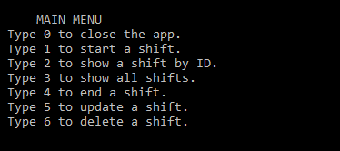
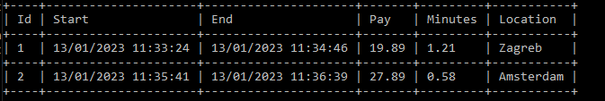

# ShiftTracker-UI

Sixth application in a series for learning .net. 

**This branch** contains UI, [other](https://github.com/Walter4B/ShiftTracker#shifttracker-api) branch contains the API, this was done to test out the orphan branch concept.

On startup application creates a new in memory database, based on DbContext(ShiftContext)

## Requirements: 
 - [x] This is an application where you should record a worker's shifts.
 - [x] You need to create two applications: the Web API and the UI that will call it.
 - [x] All validation and user input should happen in the UI app.
 - [x] Your API's controller should be lean. Any logic should be handled in a separate "service".
 - [x] You should use SQL Server, not SQLite
 - [x] You should use the "code first" approach to create your database, using Entity Framework's migrations tool.

## Features
- Category Menu
  - On startup UI side of the application connects to API using HttpClient
  - All CRUD commands in API can be called from the UI
  - 

- Reporting
  - "ConsoleTableExt" library was used for table display 
  - 

## Tech stack:
- ConsoleTableExt
- Newtonsoft.Json
- Http.Headers
- Http
- .net 6.0

Special thanks to [Cappuccinocodes](https://github.com/cappuccinocodes) for help and advice.
